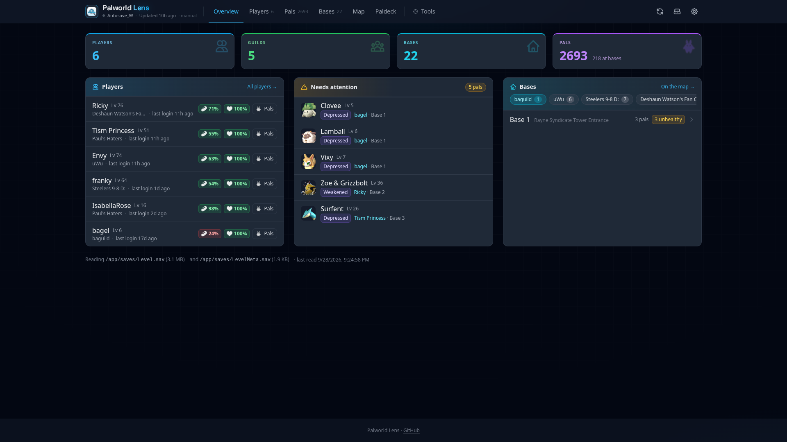
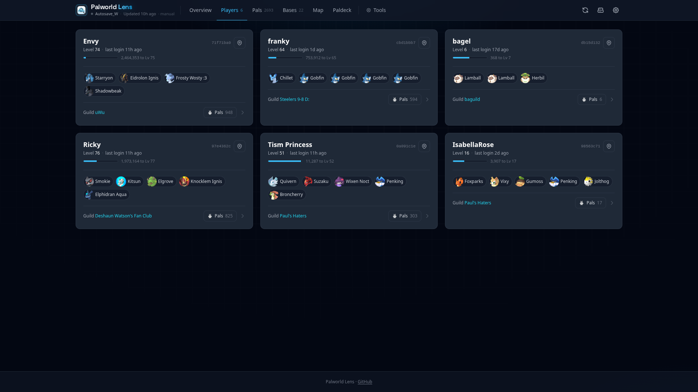
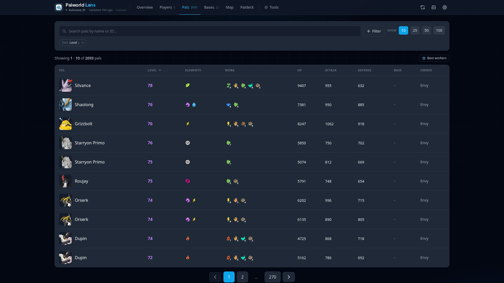
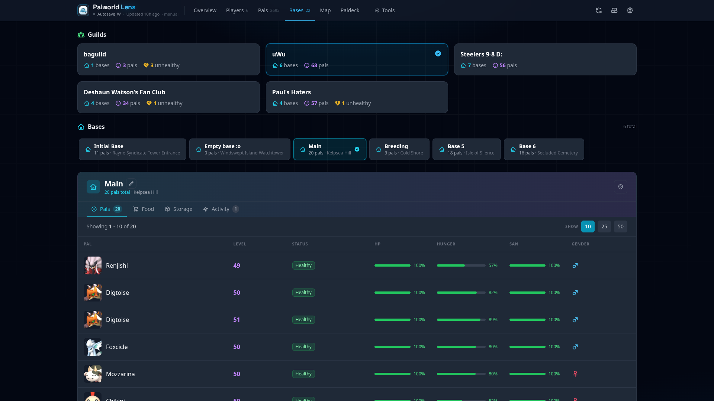
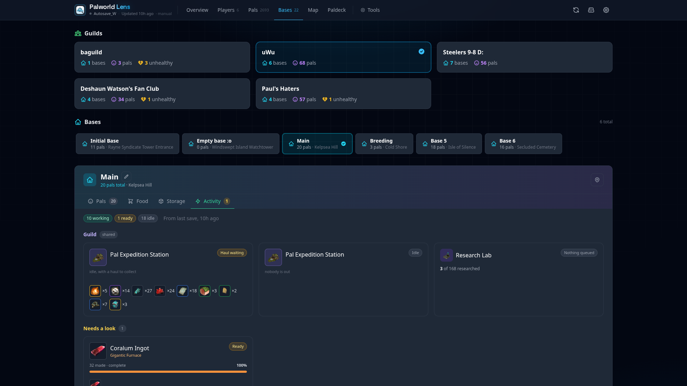
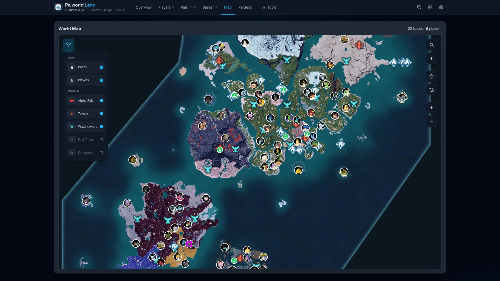
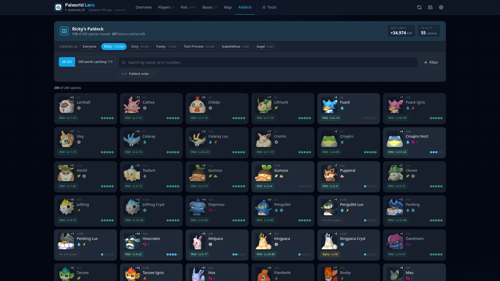
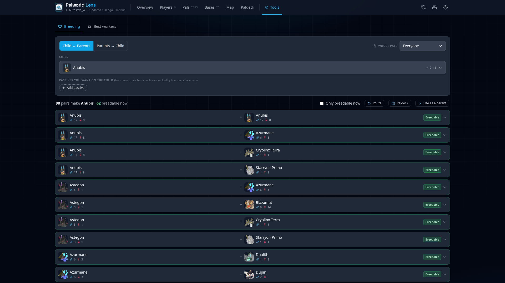
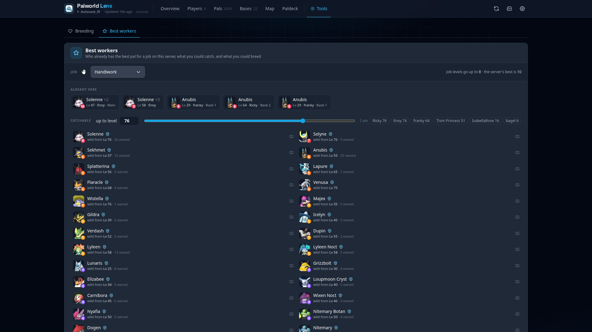

# Palworld Lens

Palworld Lens reads your Palworld world save and shows what's going on in it from a browser, phone included: what every pal at every base is doing, who's online, where things spawn, what you can breed. I built it for my own server so I could check on our bases without logging in, and it grew from there.

It only reads the save. It never writes to it.

*Unofficial fan project, not affiliated with or endorsed by Pocketpair.*

<div align="center">
  
  
  
  <br/>
  
  
  
  <br/>
  
  
  
</div>

## What's in it

- **Bases.** Every guild and base, each pal's hunger, sanity and status, food bowls, and storage you can search across a whole guild. The Activity view shows what the base was doing at the last save: machines and their orders, crops, eggs, ranches, expeditions and lab research.
- **Pals.** Every pal on the server with stats, skills, work levels and owner. Filter by element, job, passive or owner.
- **Players.** Level, health, hunger, guild and party, who's online and when everyone was last seen. Click a player for their inventory and stats.
- **Map.** Bases and players on the world map, plus towers, dungeons, fast travel points and alpha pals. Search a pal and every place it spawns lights up, with level ranges and night-only spots.
- **Paldeck.** Every species: work levels, partner skill, drops, moves, where it spawns, how to breed it, and who on the server has one. Pick a player and it becomes their capture tracker, showing which catches still pay out.
- **Breeding.** What two pals make, every pair that makes a given pal, and which of your own pals fit. If you can't breed something yet, it plans the shortest chain from what you already have.
- **Best workers.** The best pal for a job, split into ones you already own, ones you could catch, and ones you could breed.

It can also keep itself up to date as the game autosaves, pull the save from a remote host over SFTP or FTP, and show server info (players, uptime, settings) if you give it RCON access.

## Getting started

You need Docker and access to your world's save folder: the one with `Level.sav` and a `Players/` folder in it.

1. Download the compose file:
   ```bash
   wget https://raw.githubusercontent.com/parmati94/palworld-lens/main/docker-compose.yml
   ```

2. Point it at your save folder:
   ```yaml
   volumes:
     - /path/to/your/SaveGames/0/WORLD-ID:/app/saves:ro
   ```

3. Start it and open `http://localhost:5175`:
   ```bash
   docker-compose up -d
   ```

If your server is hosted somewhere you can't mount a folder from, see "Loading the save from another machine" below.

To build it yourself instead, clone the repo, run `docker build -t palworld-lens:local .`, and set `image: palworld-lens:local` in the compose file.

## Settings

Everything is set with environment variables in `docker-compose.yml`. Only the save folder is required; the rest is optional.

The basics:

```yaml
environment:
  - SAVE_MOUNT_PATH=/app/saves   # where the save folder is mounted
  - ENABLE_AUTO_WATCH=true       # refresh the page when the game saves (can be switched off in the app)
  - TZ=America/New_York          # your timezone
  - LOG_LEVEL=INFO
```

**Somewhere to keep its own data.** Custom base names and "last seen" times are stored in `APP_STATE_PATH`. Mount a folder there to keep them; without it, base renaming is turned off.

```yaml
  - APP_STATE_PATH=/app/state
```

**Login.** Off by default. One username and password, sessions last a week.

```yaml
  - ENABLE_LOGIN=true
  - USERNAME=admin
  - PASSWORD=changeme
  - SESSION_SECRET=some-long-random-string
```

**Server info and online status.** Give it your server's admin password and it shows server info, who's online, and when each player was last seen. To track "last seen", it asks the server for the player list once a minute.

```yaml
  - RCON_HOST=your-server-ip
  - RCON_PORT=8212
  - RCON_PASSWORD=your-admin-password
```

**Loading the save from another machine.** If the server runs on a host or a game server provider, Palworld Lens can download the save over SFTP or FTP on a timer instead of reading a mounted folder. Port 22 means SFTP, port 21 means FTP.

```yaml
  - REMOTE_SAVE_ENABLED=true
  - REMOTE_HOST=your-server-ip
  - REMOTE_PORT=22
  - REMOTE_USER=username
  - REMOTE_PASSWORD=password            # not needed if you use a key
  - REMOTE_KEY_PATH=/app/.ssh/id_rsa    # SFTP key, tried before the password
  - REMOTE_KEY_PASSPHRASE=              # if the key has one
  - REMOTE_PATH=/path/to/saves
  - REMOTE_POLL_INTERVAL=60             # seconds between checks
```

To use an SSH key, mount it too: `- ~/.ssh/id_rsa:/app/.ssh/id_rsa:ro`.

### A note on security

The login is meant for a home network. Keep the app on your LAN, or put it behind a VPN or a reverse proxy with its own login, rather than opening the port to the internet. It can't change your save, but it does show everyone's location, inventory and bases.

## Development

`docker-compose.dev.yml` runs the backend with auto-reload:

```bash
docker-compose -f docker-compose.dev.yml up --build
```

Backend changes reload within a couple of seconds. For frontend changes, run `npm run build` in `frontend/` and refresh. Auto-watch is off in dev mode, because open live-update connections slow down the reloader.

### Tests

```bash
python3 -m venv .venv && .venv/bin/pip install -r requirements-dev.txt
.venv/bin/python -m pytest                       # backend
python scripts/datagen/validate.py --skip-tiles  # game data, icons and map objects line up
cd frontend && node --test 'tests/*.test.mjs'    # frontend logic
cd frontend && npm run test:e2e                  # smoke tests against a running dev instance
```

The first three run in CI on every pull request.

### API

The UI is built entirely on a JSON API under `/api/`, so you can use it for your own scripts too. The main endpoints are `/api/players`, `/api/guilds`, `/api/pals`, `/api/base-containers`, `/api/activity`, `/api/paldeck`, `/api/map-objects` and `/api/spawns`. `/api/watch` is a live stream of save changes.

### Game data

The tables in `data/json` come from [palworld-save-pal](https://github.com/oMaN-Rod/palworld-save-pal). Icons, map tiles, spawn zones and the rest are pulled from the game files. [`scripts/datagen/README.md`](scripts/datagen/README.md) explains how to update them after a patch.

## Thanks

Save parsing comes from [palworld-save-tools](https://github.com/oMaN-Rod/palworld-save-tools). Game data and plenty of ideas come from [palworld-save-pal](https://github.com/oMaN-Rod/palworld-save-pal).

## License

The code is [MIT](LICENSE). The game data tables from palworld-save-pal are GPL v3, like that project; [`data/json/NOTICE.md`](data/json/NOTICE.md) lists which files those are.

Palworld and its names, images, icons and map art are © Pocketpair, Inc. This project is free and follows Pocketpair's [guidelines for derivative works](https://www.pocketpair.jp/guidelines-derivativework).
